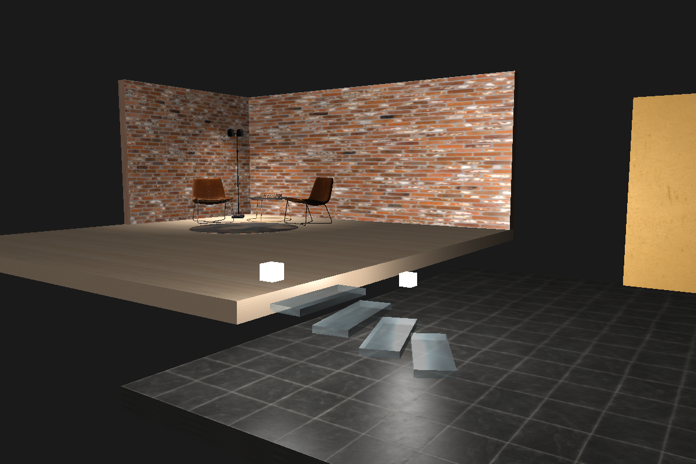
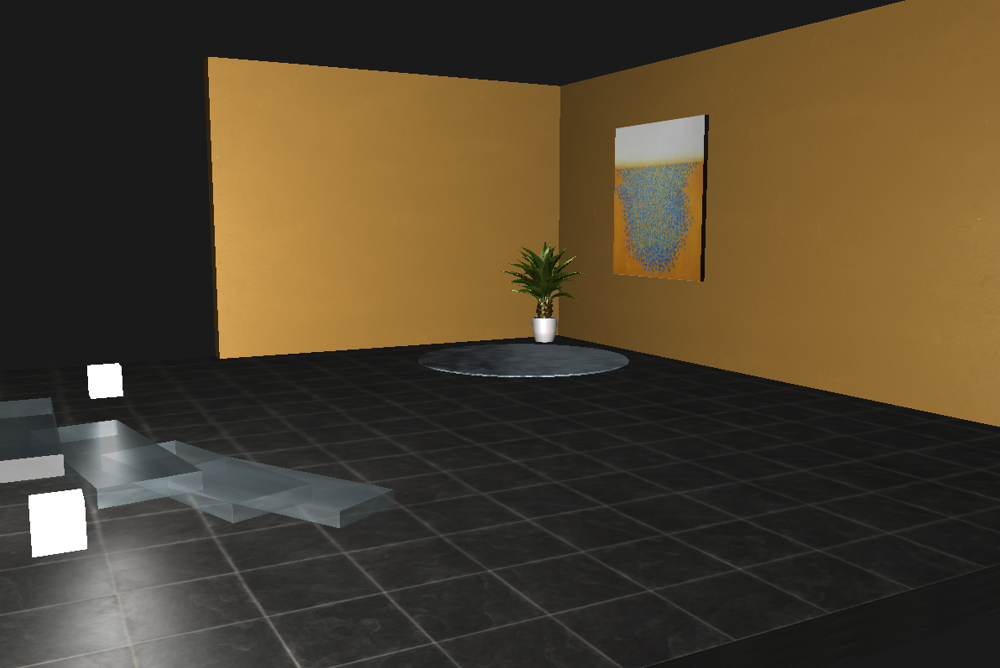
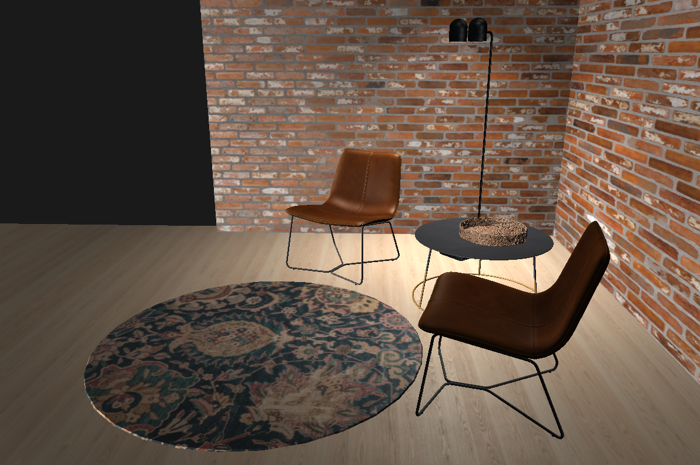

# cg-course-project

This project is a computer graphics course project based on [base project](https://github.com/matf-racunarska-grafika/project_base)
provided for the course, created using OpenGL, GLFW, GLM and Glad.

Textures and models used in this project were sourced from: 
- https://www.poliigon.com
- https://www.turbosquid.com

Textures were additionally modified in Gimp.

### Controls

**Camera:**
- **W** : move camera forward
- **S** : move camera backward
- **A** : move camera to the left
- **D** : move camera to the right
- **mouse scroll** to zoom in/out
- **move mouse** to direct camera

**Other:**
- **ESC** : exit

### Visuals

  

  

